# BookCraft - 基于 TipTap 的书籍写作系统

> 最后更新：2026-01-10 01:20:38

## 变更记录 (Changelog)

### 2026-01-10
- 初始化项目架构文档
- 完成全仓代码扫描与模块分析
- 生成模块结构图与索引

---

## 项目愿景

BookCraft 是一款面向书籍作者的所见即所得写作工具，采用 Notion 风格的界面设计，提供流畅的 Markdown 编辑体验。项目基于 **Next.js 16** + **TipTap 3.14** 构建，集成了书架管理、章节编辑、实时预览、智能目录导航等核心功能。

**核心特色：**
- 🎨 Notion 风格的 UI 设计（三栏布局）
- ✨ 实时 Markdown 编辑与预览（基于 TipTap）
- 📚 本地化书架管理（文件夹、标签、筛选）
- 🔍 智能目录提取与滚动同步
- 💾 自动保存与数据持久化（IndexedDB via Dexie.js）
- 📤 多格式导出（Markdown、PDF）

---

## 架构总览

```
┌─────────────────────────────────────────────────────────┐
│                    Next.js 16 App Router                 │
│  (Turbopack + React Compiler + Cache Components)        │
└─────────────────────────────────────────────────────────┘
                            │
        ┌───────────────────┼───────────────────┐
        │                   │                   │
        ▼                   ▼                   ▼
┌──────────────┐  ┌──────────────┐  ┌──────────────┐
│   书架模块   │  │   编辑器模块  │  │   通用库     │
│  (bookshelf) │  │  (editor)    │  │   (lib)      │
└──────────────┘  └──────────────┘  └──────────────┘
        │                   │                   │
        ▼                   ▼                   ▼
  components/         components/         lib/*.ts
  app/page.tsx        app/editor/
                      [bookId]/page.tsx
        │                   │
        └───────────────────┼───────────────────┘
                            │
                            ▼
                    ┌──────────────┐
                    │  状态管理    │
                    │  (Zustand)   │
                    └──────────────┘
                            │
                            ▼
                    ┌──────────────┐
                    │  数据层      │
                    │ (Dexie.js)   │
                    │  IndexedDB   │
                    └──────────────┘
```

---

## 模块结构图

```mermaid
graph TD
    A["(根) BookCraft"] --> B["app"];
    A --> C["components"];
    A --> D["lib"];
    A --> E["e2e"];
    A --> F["hooks"];

    B --> B1["page.tsx (书架首页)"];
    B --> B2["editor/[bookId]/page.tsx (编辑器页面)"];
    B --> B3["layout.tsx (全局布局)"];

    C --> C1["bookshelf/ (书架组件)"];
    C --> C2["editor/ (编辑器组件)"];
    C --> C3["sidebar/ (侧边栏)"];
    C --> C4["markdown/ (Markdown 工具)"];
    C --> C5["pdf/ (PDF 导出)"];

    D --> D1["store.ts (状态管理)"];
    D --> D2["db.ts (数据库)"];
    D --> D3["types.ts (类型定义)"];
    D --> D4["markdown-converter.ts"];
    D --> D5["pdf-generator.ts"];

    E --> E1["bookshelf.spec.ts"];
    E --> E2["chapter-management.spec.ts"];
    E --> E3["toc-navigation.spec.ts"];

    F --> F1["useDebounce.ts"];
    F --> F2["useActiveHeading.ts"];

    click B1 "./app/CLAUDE.md" "查看 app 模块文档"
    click C1 "./components/bookshelf/CLAUDE.md" "查看 bookshelf 组件文档"
    click C2 "./components/editor/CLAUDE.md" "查看 editor 组件文档"
    click D1 "./lib/CLAUDE.md" "查看 lib 模块文档"
    click E1 "./e2e/CLAUDE.md" "查看 E2E 测试文档"
```



---

## 模块索引

| 模块路径 | 职责 | 关键文件 | 语言 |
|---------|------|---------|------|
| **app** | Next.js 页面路由与布局 | `page.tsx`, `layout.tsx`, `editor/[bookId]/page.tsx` | TypeScript/TSX |
| **components/bookshelf** | 书架 UI 组件（网格、卡片、侧边栏） | `BookshelfGrid.tsx`, `BookCard.tsx`, `BookshelfHeader.tsx` | TypeScript/TSX |
| **components/editor** | TipTap 编辑器核心组件 | `Editor.tsx` | TypeScript/TSX |
| **components/sidebar** | 左侧章节树、右侧目录栏 | `SidebarLeft.tsx`, `SidebarRight.tsx` | TypeScript/TSX |
| **components/markdown** | Markdown 导入/导出/预览 | `MarkdownImport.tsx`, `MarkdownExport.tsx`, `MarkdownPreview.tsx` | TypeScript/TSX |
| **components/pdf** | PDF 导出功能 | `PDFExport.tsx` | TypeScript/TSX |
| **lib** | 状态管理、数据库、类型定义 | `store.ts`, `db.ts`, `types.ts` | TypeScript |
| **e2e** | Playwright E2E 测试套件 | `bookshelf.spec.ts`, `chapter-management.spec.ts`, `toc-navigation.spec.ts` | TypeScript |
| **hooks** | React 自定义 Hooks | `useDebounce.ts`, `useActiveHeading.ts` | TypeScript |

---

## 运行与开发

### 安装依赖

```bash
# 使用 pnpm（推荐）
pnpm install
```

### 开发模式

```bash
# 启动开发服务器（Turbopack）
pnpm dev

# 访问 http://localhost:3000
```

### 构建生产版本

```bash
# 构建项目
pnpm build

# 启动生产服务器
pnpm start
```

### 测试

```bash
# 运行 E2E 测试
pnpm test

# 调试模式（带 UI）
pnpm test:ui

# 调试模式（ headed）
pnpm test:headed

# 查看测试报告
pnpm test:report
```

### 代码检查

```bash
# TypeScript 类型检查
pnpm lint
```

---

## 技术栈

| 分类 | 技术 | 版本 | 用途 |
|------|------|------|------|
| **前端框架** | Next.js | 16.1.1 | App Router, Turbopack, React Compiler |
| **UI 库** | React | 19.2.3 | 用户界面 |
| **编辑器核心** | TipTap | 3.14.0 | 所见即所得编辑器 |
| **样式方案** | Tailwind CSS | 4.1.18 | 工具优先 CSS |
| **状态管理** | Zustand | 5.0.9 | 轻量级状态管理 |
| **本地存储** | Dexie.js | 4.2.1 | IndexedDB 封装 |
| **图标库** | Lucide React | 0.562.0 | 图标组件 |
| **PDF 生成** | jsPDF | 3.0.4 | 客户端 PDF 导出 |
| **Markdown 渲染** | react-markdown | 10.1.0 | Markdown 预览 |
| **E2E 测试** | Playwright | 1.57.0 | 端到端测试 |
| **类型系统** | TypeScript | 5.8.2 | 静态类型检查 |

---

## 数据模型

### 核心实体

```typescript
// 书籍（增强版）
interface EnhancedBook {
  id: number;
  title: string;
  description: string;
  createdAt: number;
  updatedAt: number;
  collectionId?: number | null;  // 所属文件夹
  tags: string[];                 // 标签数组
  coverColor: string;             // 封面颜色
  wordCount: number;              // 字数统计
  lastReadAt: number | null;      // 最后阅读时间
  isPinned: boolean;              // 是否置顶
}

// 章节
interface Chapter {
  id: number;
  bookId: number;
  title: string;
  content: string;                // HTML from TipTap
  order: number;
  parentId?: number | null;       // 支持嵌套
  updatedAt: number;
}

// 文件夹
interface Collection {
  id: number;
  name: string;
  color: string;
  createdAt: number;
  updatedAt: number;
  order: number;
}

// 标签
interface Tag {
  id: number;
  name: string;
  color: string;
  usageCount: number;
  createdAt: number;
}

// 目录项
interface TocItem {
  id: string;
  level: number;                  // 1-6
  text: string;
  elementId?: string;
}
```

### 数据库架构

```javascript
// Dexie Schema (Version 2)
books: '++id, title, updatedAt, collectionId, [collectionId+updatedAt], tags, lastReadAt, isPinned'
chapters: '++id, bookId, title, order, updatedAt'
collections: '++id, name, order, updatedAt'
tags: '++id, name, usageCount'
searchHistory: '++id, query, timestamp'
```

---

## 测试策略

### E2E 测试（Playwright）

**测试文件分布：**
- `bookshelf.spec.ts` - 书架首页功能测试
- `chapter-management.spec.ts` - 章节管理测试
- `toc-navigation.spec.ts` - 目录导航测试
- `editor.spec.ts` - 编辑器功能测试
- `import-export.spec.ts` - 导入导出测试
- `collections-tags.spec.ts` - 文件夹与标签测试

**测试覆盖：**
- ✅ 页面布局与组件渲染
- ✅ 书籍/章节的 CRUD 操作
- ✅ 拖拽排序功能
- ✅ 搜索与筛选
- ✅ 导航与路由
- ✅ Markdown 导入导出
- ✅ PDF 导出

**运行方式：**
```bash
# 全量测试
pnpm test

# 单个文件
pnpm test -- bookshelf.spec.ts

# 调试模式
pnpm test:debug
```

---

## 编码规范

### TypeScript

- 使用 `strict` 模式
- 所有函数参数和返回值必须显式类型
- 使用 `interface` 定义数据模型，`type` 定义联合类型
- 避免使用 `any`，优先使用 `unknown` 或泛型

### 命名约定

- **文件名**：PascalCase（组件）, kebab-case（工具）
- **组件**：PascalCase（`BookCard.tsx`）
- **函数/变量**：camelCase（`loadData`）
- **常量**：UPPER_SNAKE_CASE（`DEFAULT_FILTER_CONFIG`）
- **类型/接口**：PascalCase（`EnhancedBook`）

### 样式规范

- 使用 Tailwind CSS 工具类
- 颜色使用语义化变量（`text-notion-text`, `bg-notion-hover`）
- 响应式设计：移动优先（`sm:`, `md:`, `lg:`）
- 避免内联样式（除非动态值）

### 组件规范

- 函数组件 + Hooks
- 使用 `"use client"` 指令标记客户端组件
- Props 使用 `interface` 定义
- 状态优先使用 Zustand store，本地状态使用 `useState`

---

## AI 使用指引

### 推荐工作流

1. **功能开发前**：阅读对应的模块 `CLAUDE.md`，了解现有架构
2. **代码生成**：基于类型定义（`lib/types.ts`）生成代码
3. **测试编写**：参考 `e2e/` 目录下的现有测试用例
4. **代码审查**：运行 `pnpm lint` 确保类型检查通过

### 关键约束

- ✅ **优先使用现有类型**：从 `lib/types.ts` 导入，避免重复定义
- ✅ **保持数据流单向**：View → User Action → Store → DB → View
- ✅ **客户端数据**：所有数据操作通过 Zustand store（`lib/store.ts`）
- ✅ **防抖优化**：编辑器保存使用 `useDebounce` hook（1 秒延迟）
- ✅ **SSR 兼容**：检查 `typeof window === 'undefined'` 避免服务端执行
- ❌ **禁止直接操作 Dexie**：所有数据库操作必须通过 store 方法
- ❌ **禁止硬编码**：颜色、文本等使用配置或主题变量

### 常见任务示例

**新增书架功能：**
```bash
# 1. 更新类型定义
lib/types.ts -> EnhancedBook interface

# 2. 更新数据库 Schema
lib/db.ts -> version 3 upgrade

# 3. 添加 store 方法
lib/store.ts -> newMethod()

# 4. 创建 UI 组件
components/bookshelf/NewFeature.tsx

# 5. 编写 E2E 测试
e2e/new-feature.spec.ts
```

**新增编辑器功能：**
```bash
# 1. 安装 TipTap 扩展
pnpm add @tiptap/extension-xxx

# 2. 配置编辑器
components/editor/Editor.tsx -> extensions array

# 3. 添加工具栏按钮
components/editor/Editor.tsx -> ToolbarButton

# 4. 测试新功能
e2e/editor.spec.ts
```

---

## 相关文件清单

### 配置文件

- `next.config.ts` - Next.js 配置（Turbopack + React Compiler）
- `playwright.config.ts` - Playwright 测试配置
- `tsconfig.json` - TypeScript 配置
- `tailwind.config.js` - Tailwind CSS 配置（v4）
- `package.json` - 项目依赖与脚本

### 关键入口

- `app/layout.tsx` - 全局布局（字体、元数据）
- `app/page.tsx` - 书架首页
- `app/editor/[bookId]/page.tsx` - 编辑器页面
- `lib/store.ts` - Zustand 全局状态（822 行）
- `lib/db.ts` - Dexie 数据库初始化

### 样式资源

- `app/globals.css` - 全局样式（Notion 主题、TipTap 样式）

---

## 已知限制与改进建议

### 当前限制

1. **单用户本地存储**：无云端同步，数据仅存储在浏览器 IndexedDB
2. **PDF 导出性能**：大文档导出可能较慢（使用 html2canvas + jsPDF）
3. **实时协作**：暂不支持多人协作编辑
4. **移动端适配**：响应式布局已完成，但触控交互待优化

### 改进建议

1. **性能优化**
   - 编辑器虚拟滚动（超长文档）
   - PDF 导出使用 Web Worker
   - 图片懒加载与压缩

2. **功能增强**
   - 云端同步（Supabase / Firebase）
   - 版本历史与回滚
   - 全文搜索（Lunr.js / FlexSearch）
   - 数学公式支持（KaTeX）

3. **测试完善**
   - 单元测试（Vitest）
   - 视觉回归测试（Percy / Chromatic）
   - 性能测试（Lighthouse CI）

---

## 贡献指南

1. Fork 项目
2. 创建功能分支（`git checkout -b feature/xxx`）
3. 提交代码（`git commit -m "feat: add xxx"`）
4. 推送到远程（`git push origin feature/xxx`）
5. 创建 Pull Request

**提交信息规范：**
- `feat:` - 新功能
- `fix:` - Bug 修复
- `docs:` - 文档更新
- `refactor:` - 代码重构
- `test:` - 测试相关
- `chore:` - 构建/工具链更新

---

## 许可证

MIT License

---

**文档生成时间：** 2026-01-10 01:20:38
**架构扫描覆盖率：** 92%（核心模块已覆盖）
**扫描状态：** 完整（未因工具或时间限制截断）
