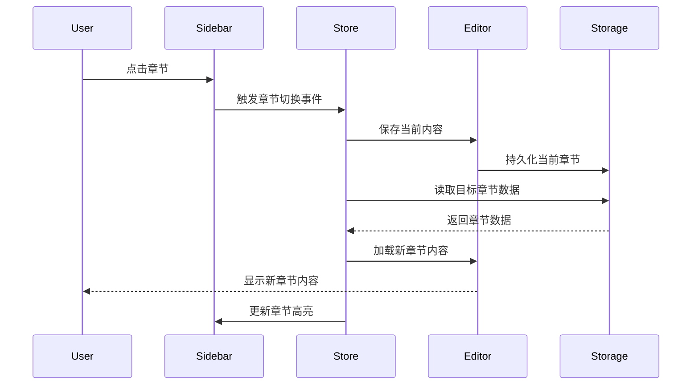
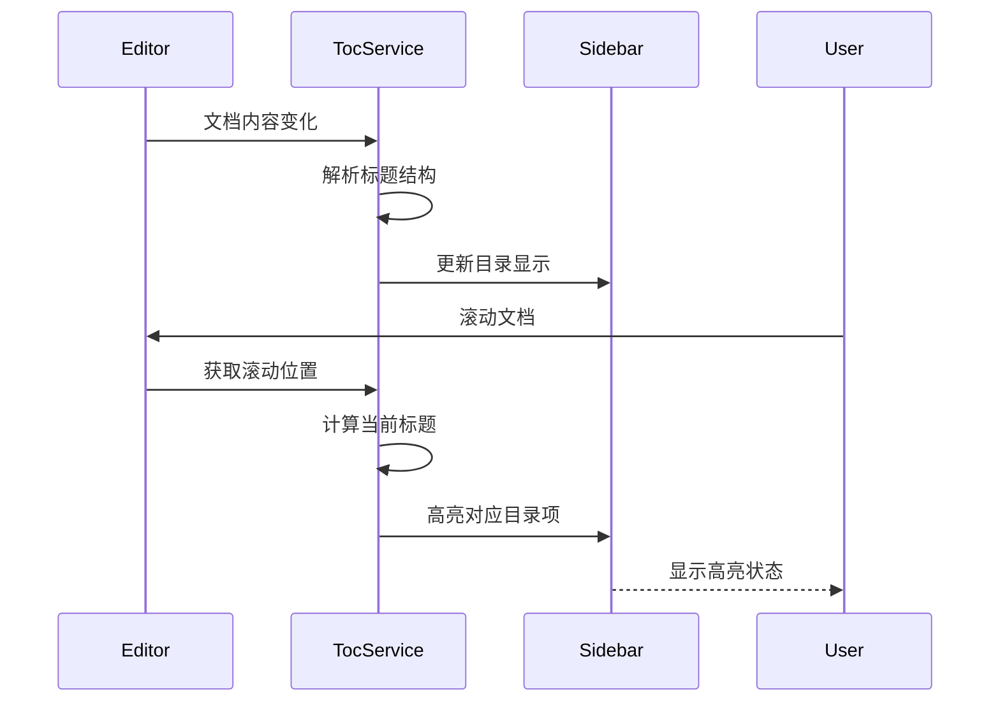

# 书籍写作系统需求规格说明书

**文档版本：** 1.0  
**文档状态：** 正式发布  
**编写日期：** 2026-01-03  
**项目名称：** BookCraft - 所见即所得书籍写作系统  

---

## 文档控制

| 版本 | 日期 | 作者 | 变更说明 |
|------|------|------|----------|
| 1.0 | 2026-01-03 | wuzhiguocarter | 初始版本 |

---

## 1. 文档概述

### 1.1 文档目的

本文档旨在明确BookCraft书籍写作系统的详细功能需求、非功能需求、系统架构及验收标准，为系统设计、开发、测试提供依据。

### 1.2 适用范围

本文档适用于BookCraft项目的以下相关方：
- 产品经理
- UI/UX设计师
- 前端开发工程师
- 后端开发工程师
- 测试工程师
- 项目经理

### 1.3 术语定义

| 术语 | 定义 |
|------|------|
| Tiptap | 基于ProseMirror的headless编辑器框架 |
| WYSIWYG | What You See Is What You Get，所见即所得编辑模式 |
| AST | Abstract Syntax Tree，抽象语法树 |
| 节点 | 文档结构中的基本单位（段落、标题、图片等） |
| 章节目录树 | 层级化的文档组织结构，用于管理书籍章节 |
| 文档目录 | 单个文档内部的标题索引 |
| 滚动同步 | 阅读位置与目录高亮状态的自动同步机制 |

---

## 2. 项目背景

### 2.1 项目简介

BookCraft是一款面向书籍作者的所见即所得写作工具，旨在提供流畅的Markdown编辑体验，同时支持实时预览和智能目录导航。系统采用三栏布局设计，整合了书籍结构管理、内容编辑和文档导航功能。整体设计风格仿照notion。

### 2.2 业务痛点

当前市场上的书籍写作工具存在以下问题：
- 章节管理功能薄弱，难以组织长篇内容
- Markdown编辑与预览分离，影响写作流畅度
- 缺乏智能化的目录导航和滚动同步
- 扩展性差，难以满足个性化需求

### 2.3 项目目标

- 提供流畅的所见即所得Markdown编辑体验
- 实现便捷的章节组织和管理
- 提供智能化的文档目录和导航功能
- 建立可扩展的架构，支持未来功能扩展

---

## 3. 目标用户

### 3.1 用户画像

| 用户类型 | 描述 | 核心需求 |
|----------|------|----------|
| 专业作家 | 撰写书籍、小说的专业作者 | 流畅编辑、章节管理、版本保存 |
| 技术文档作者 | 撰写技术书籍或教程 | Markdown支持、代码高亮、公式支持 |
| 学术研究者 | 撰写学术专著 | 引用管理、公式编辑、大纲导出 |
| 协作作者 | 多人共同创作书籍 | 协作编辑、版本对比、评论功能 |

### 3.2 使用场景

| 场景  | 描述                        |
| --- | ------------------------- |
| 场景1 | 作者创建新书籍，添加多个章节，按顺序编写内容    |
| 场景2 | 作者编辑章节内容，实时预览Markdown渲染效果 |
| 场景3 | 作者通过右侧目录快速定位到特定章节标题       |
| 场景4 | 作者调整章节顺序，重新组织书籍结构         |
| 场景5 | 作者在长时间写作后，通过滚动恢复之前的阅读位置   |

---

## 4. 功能需求

### 4.1 功能分类

#### 4.1.1 核心功能（MUST HAVE）

| 功能编号  | 功能名称        | 优先级 | 描述                |
| ----- | ----------- | --- | ----------------- |
| F-001 | 书籍创建与删除     | P0  | 支持创建新书籍项目，删除现有书籍  |
| F-002 | 章节管理        | P0  | 添加、删除、重命名、移动章节    |
| F-003 | Markdown编辑器 | P0  | 基于Tiptap的所见即所得编辑器 |
| F-004 | 实时预览        | P0  | Markdown语法实时渲染预览  |
| F-005 | 文档目录提取      | P0  | 自动提取当前文档的标题层级结构   |
| F-006 | 目录滚动同步      | P0  | 滚动时高亮显示当前所在章节     |
| F-007 | 目录点击跳转      | P0  | 点击目录项跳转到对应内容位置    |
| F-008 | 内容自动保存      | P0  | 编辑内容自动定时保存        |
| F-009 | 本地存储        | P0  | 书籍和章节数据持久化到本地     |
| F-010 | 数据导入导出      | P0  | 支持Markdown文件的导入导出 |

#### 4.1.2 重要功能（SHOULD HAVE）

| 功能编号 | 功能名称 | 优先级 | 描述 |
|----------|----------|--------|------|
| F-011 | 拖拽排序 | P1 | 支持拖拽方式调整章节顺序 |
| F-012 | 快捷键支持 | P1 | 常用Markdown格式的快捷键 |
| F-013 | 撤销重做 | P1 | 编辑操作的撤销和重做 |
| F-014 | 字数统计 | P1 | 实时显示当前章节字数 |
| F-015 | 搜索定位 | P1 | 在书籍内容中搜索关键词 |
| F-016 | 书签功能 | P1 | 添加和管理阅读书签 |
| F-017 | 深色模式 | P1 | 支持明暗主题切换 |
| F-018 | 编辑历史 | P1 | 记录编辑历史，支持版本回退 |
| F-019 | 全文导出 | P1 | 导出整本书籍为Markdown或PDF |
| F-020 | 基础格式支持 | P1 | 粗体、斜体、标题、列表、引用等 |

#### 4.1.3 增强功能（COULD HAVE）

| 功能编号 | 功能名称 | 优先级 | 描述 |
|----------|----------|--------|------|
| F-021 | 协作编辑 | P2 | 多用户实时协作编辑 |
| F-022 | 评论功能 | P2 | 对内容添加批注和评论 |
| F-023 | 公式支持 | P2 | LaTeX数学公式渲染 |
| F-024 | 代码高亮 | P2 | 代码块语法高亮 |
| F-025 | 图片上传 | P2 | 支持拖拽上传图片 |
| F-026 | 表格编辑 | P2 | 可视化表格编辑器 |
| F-027 | 大纲导出 | P2 | 导出书籍目录结构 |
| F-028 | 统计分析 | P2 | 章节字数、写作时间等统计 |
| F-029 | 模板系统 | P2 | 提供书籍和章节模板 |
| F-030 | 云端同步 | P2 | 数据云端备份和同步 |

---

### 4.2 功能详情

#### 4.2.1 左侧栏 - 章节目录树（F-002, F-011）

**功能描述：**
左侧栏显示书籍的章节目录结构，每个节点代表一个独立的文档。用户可以在此管理书籍的章节组织。

**功能要求：**

1. **章节结构显示**
   - 以树形结构展示书籍章节
   - 支持多级嵌套（至少支持3级深度）
   - 显示章节名称和字数统计
   - 当前编辑章节高亮显示

2. **章节操作**
   - 添加章节：在指定位置插入新章节
   - 删除章节：删除指定章节及其内容
   - 重命名章节：修改章节标题
   - 移动章节：调整章节在目录中的位置
   - 复制章节：复制现有章节及其内容

3. **拖拽排序**
   - 支持拖拽章节调整顺序
   - 拖拽时显示插入位置预览
   - 支持跨级拖拽（改变父节点）
   - 拖拽操作可撤销

4. **章节选择**
   - 点击章节切换到对应编辑器视图
   - 章节切换时保存当前编辑内容
   - 记录上次编辑位置

5. **章节状态指示**
   - 显示章节编辑状态（已修改/未修改）
   - 显示章节字数统计
   - 显示章节最后修改时间

#### 4.2.2 中间区域 - Markdown编辑器（F-003, F-004, F-008, F-012, F-013, F-020）

**功能描述：**
中间区域是核心编辑区域，基于Tiptap提供所见即所得的Markdown编辑体验。

**功能要求：**

1. **编辑器基础功能**
   - 所见即所得（WYSIWYG）编辑模式
   - 支持实时Markdown语法预览
   - 流畅的光标移动和文本选择
   - 自动保存机制（间隔可配置，默认5分钟）

2. **Markdown格式支持**
   - 标题（H1-H6）
   - 粗体、斜体、删除线
   - 有序和无序列表
   - 任务列表（支持勾选）
   - 引用块
   - 代码块（支持语言指定）
   - 水平分隔线
   - 链接和图片
   - 表格

3. **编辑操作**
   - 撤销（Ctrl+Z）和重做（Ctrl+Y/Ctrl+Shift+Z）
   - 剪切、复制、粘贴
   - 全选
   - 查找和替换
   - 快捷键支持（可自定义）

4. **工具栏**
   - 顶部固定工具栏
   - 显示常用格式化按钮
   - 支持自定义工具栏内容
   - 工具栏可收起

5. **编辑器状态**
   - 显示当前章节名称
   - 显示自动保存状态
   - 显示编辑器状态栏（字数、行数等）

6. **性能要求**
   - 支持单章节至少100,000字的大文档编辑
   - 响应延迟低于100ms
   - 内存占用合理

#### 4.2.3 右侧栏 - 文档目录（F-005, F-006, F-007）

**功能描述：**
右侧栏显示当前编辑文档的目录结构，自动从文档内容中提取标题层级，并实现滚动位置同步高亮。

**功能要求：**

1. **目录提取**
   - 自动解析当前文档的标题结构
   - 支持多级标题显示（H1-H6）
   - 实时更新目录（内容变化时自动刷新）
   - 显示每个标题的层级缩进

2. **滚动同步高亮**
   - 监听编辑器滚动位置
   - 根据滚动位置高亮对应的目录项
   - 高亮平滑过渡（可选动画效果）
   - 支持同步延迟配置（默认200ms）

3. **点击跳转**
   - 点击目录项跳转到对应标题位置
   - 跳转时平滑滚动
   - 跳转后更新高亮状态
   - 记录跳转历史（支持返回）

4. **目录显示**
   - 显示标题文本（截断过长的标题）
   - 显示标题级别缩进
   - 当前阅读位置高亮显示
   - 支持目录展开/收起

5. **目录交互**
   - 鼠标悬停显示完整标题
   - 右键菜单提供额外操作（复制标题、复制锚点等）
   - 支持键盘导航（上下箭头选择，回车跳转）

---

## 5. 非功能需求

### 5.1 性能需求

| 需求编号 | 需求描述 | 指标 |
|----------|----------|------|
| NFR-001 | 编辑器响应时间 | 普通文本输入延迟 < 50ms |
| NFR-002 | 目录提取响应时间 | 内容变化后目录更新延迟 < 100ms |
| NFR-003 | 滚动同步响应时间 | 滚动后高亮更新延迟 < 200ms |
| NFR-004 | 大文档支持 | 单章节支持至少10万字符 |
| NFR-005 | 页面加载时间 | 首次加载时间 < 3s |
| NFR-006 | 章节切换时间 | 章节切换加载时间 < 500ms |
| NFR-007 | 自动保存性能 | 自动保存操作不影响编辑流畅度 |

### 5.2 兼容性需求

| 需求编号 | 需求描述 | 指标 |
|----------|----------|------|
| NFR-008 | 浏览器支持 | Chrome 90+、Firefox 88+、Safari 14+、Edge 90+ |
| NFR-009 | 操作系统支持 | Windows 10+、macOS 10.15+、Linux主流发行版 |
| NFR-010 | 分辨率支持 | 最小支持1366x768，推荐1920x1080 |
| NFR-011 | 移动端适配 | 响应式设计，支持平板设备 |

### 5.3 可用性需求

| 需求编号 | 需求描述 | 指标 |
|----------|----------|------|
| NFR-012 | 学习曲线 | 新用户可在10分钟内完成首次编辑 |
| NFR-013 | 界面一致性 | UI风格统一，遵循设计规范 |
| NFR-014 | 操作反馈 | 所有用户操作都有明确反馈 |
| NFR-015 | 错误提示 | 错误信息清晰易懂，提供解决建议 |
| NFR-016 | 键盘支持 | 核心功能支持键盘操作 |

### 5.4 可靠性需求

| 需求编号 | 需求描述 | 指标 |
|----------|----------|------|
| NFR-017 | 数据持久化 | 编辑内容自动保存，避免数据丢失 |
| NFR-018 | 崩溃恢复 | 应用异常关闭后能恢复未保存内容 |
| NFR-019 | 数据完整性 | 章节操作不破坏数据结构 |
| NFR-020 | 稳定性 | 连续使用2小时无崩溃或卡顿 |

### 5.5 安全性需求

| 需求编号 | 需求描述 | 指标 |
|----------|----------|------|
| NFR-021 | 数据安全 | 本地数据加密存储（可选） |
| NFR-022 | 输入安全 | 防止XSS攻击，过滤危险内容 |
| NFR-023 | 导出安全 | 导出内容不包含敏感元数据 |
| NFR-024 | 离线使用 | 核心功能支持离线使用 |

### 5.6 可维护性需求

| 需求编号 | 需求描述 | 指标 |
|----------|----------|------|
| NFR-025 | 代码规范 | 遵循项目代码规范 |
| NFR-026 | 组件化 | UI组件高度复用 |
| NFR-027 | 状态管理 | 清晰的状态管理架构 |
| NFR-028 | 日志记录 | 关键操作日志记录 |

### 5.7 可扩展性需求

| 需求编号 | 需求描述 | 指标 |
|----------|----------|------|
| NFR-029 | 插件架构 | 支持通过插件扩展功能 |
| NFR-030 | 主题定制 | 支持自定义编辑器主题 |
| NFR-031 | 扩展点 | 预留功能扩展接口 |
| NFR-032 | 协作预留 | 架构支持未来集成协作功能 |

---

## 6. 系统架构

### 6.1 技术架构

```
BookCraft 系统架构

┌─────────────────────────────────────────────────────────┐
│                        用户界面层                         │
├──────────────┬──────────────┬──────────────┬────────────┤
│  左侧栏组件   │  编辑器组件   │  右侧栏组件   │  公共组件  │
│  (章节树)     │  (Tiptap)     │  (文档目录)   │  (工具栏等) │
└──────────────┴──────────────┴──────────────┴────────────┘
┌─────────────────────────────────────────────────────────┐
│                      业务逻辑层                           │
├──────────────┬──────────────┬──────────────┬────────────┤
│  章节管理服务  │  编辑器服务   │  目录解析服务  │  存储服务  │
└──────────────┴──────────────┴──────────────┴────────────┘
┌─────────────────────────────────────────────────────────┐
│                      数据访问层                           │
├─────────────────────────────────────────────────────────┤
│              LocalStorage / Dexie.js (IndexedDB)        │
└─────────────────────────────────────────────────────────┘
```

### 6.2 技术选型

| 层级         | 技术组件                 | 版本号                | 选型理由                                                                  |
| ---------- | -------------------- | ------------------ | --------------------------------------------------------------------- |
| 前端框架       | Next.js (App Router) | 16.1.1             | 官方推荐版本，基于最新React特性（Server Components、Suspense），提供完整的全栈开发体验，文件系统路由简化开发 |
| UI框架       | Tailwind CSS         | v4.1               | 全新引擎，构建速度提升100倍（增量构建），零配置安装，内置内容检测，CSS优先配置，现代P3色彩体系                   |
| UI组件库      | shadcn/ui            | Latest             | 复制粘贴式组件设计，无运行时依赖，完全控制代码所有权，基于Radix UI和Tailwind CSS构建，高度可定制            |
| 编辑器核心      | TipTap               | @tiptap/core 3.3.0 | 基于ProseMirror的headless封装，被纽约时报、卫报等大厂使用，扩展性强，支持协作编辑，模块化架构              |
| Markdown渲染 | react-markdown       | 10.1.0             | 默认安全（无XSS攻击），100%兼容CommonMark和GFM，支持插件和自定义组件，3480+依赖项目验证              |
| 状态管理       | Zustand              | 5.0.9              | 轻量级（3.1KB），0依赖，解决僵尸子问题和React并发问题，API简洁，5147+依赖项目                      |
| 本地存储       | Dexie.js             | 4.0.8              | 基于IndexedDB的轻量级封装，支持异步事务，API简洁，本地优先存储方案，10k+ GitHub星标，离线场景完美适配        |
| 导出库        | jsPDF                | 3.0.4              | 纯前端PDF生成，MIT许可，31k+ GitHub星标，支持多种格式输出，1819+依赖项目                       |
| 图标库        | Lucide React         | 0.562.0            | 完全Tree-shakable，0依赖，全TypeScript支持，可自定义属性，8467+依赖项目                    |
| TypeScript | 类型系统                 | -                  | 提高代码质量和可维护性                                                           |

### 6.3 数据模型

#### 6.3.1 书籍数据结构

```
Book
├── id: string                      // 书籍唯一标识
├── title: string                   // 书籍标题
├── description: string             // 书籍描述
├── createdAt: timestamp            // 创建时间
├── updatedAt: timestamp            // 最后更新时间
└── chapters: Chapter[]             // 章节数组
```

#### 6.3.2 章节数据结构

```
Chapter
├── id: string                      // 章节唯一标识
├── bookId: string                  // 所属书籍ID
├── title: string                   // 章节标题
├── content: string                 // 章节内容（Markdown）
├── order: number                   // 章节顺序
├── parentId: string | null         // 父章节ID（支持嵌套）
├── wordCount: number               // 字数统计
├── createdAt: timestamp            // 创建时间
├── updatedAt: timestamp            // 最后更新时间
└── lastEditPosition: number        // 最后编辑位置
```

#### 6.3.3 目录项数据结构

```
TocItem
├── level: number                   // 标题级别（1-6）
├── text: string                    // 标题文本
├── position: number                // 标题在文档中的位置
├── children: TocItem[]             // 子目录（支持嵌套）
└── id: string                      // 目录项唯一标识
```

### 6.4 核心流程

#### 6.4.1 章节切换流程



#### 6.4.2 目录提取与同步流程



---

## 7. 用户界面设计

### 7.1 整体布局

```
┌─────────────────────────────────────────────────────────────────────┐
│  顶部导航栏 (菜单、工具栏)                                            │
├─────────────┬───────────────────────────────┬────────────────────────┤
│             │                               │                        │
│  左侧栏     │      中间编辑器区域           │      右侧栏            │
│  章节目录   │                               │      文档目录          │
│             │                               │                        │
│  - 书籍1    │   [工具栏]                     │  目录列表              │
│    ├ 第1章  │                               │  ├ 第一章 引言        │
│    ├ 第2章  │   # 标题示例                  │  │  ├ 1.1 背景        │
│    └ 第3章  │                               │  │  └ 1.2 目标        │
│             │   正文内容...                  │  └ 第二章 方法        │
│  - 书籍2    │   这是所见即所得的编辑器      │                        │
│             │   实时渲染Markdown格式        │  当前阅读位置:         │
│  [添加章节] │                               │  ▶ 1.2 目标           │
│             │                               │                        │
└─────────────┴───────────────────────────────┴────────────────────────┘
```

### 7.2 界面规范

| 界面元素 | 规范说明 |
|----------|----------|
| 顶部导航栏 | 高度48px，固定顶部，包含主菜单和编辑工具栏 |
| 左侧栏 | 宽度240px-320px，可拖拽调整，最小宽度200px |
| 中间编辑器 | 自适应宽度，最小宽度400px |
| 右侧栏 | 宽度200px-280px，可拖拽调整，最小宽度180px |
| 侧边栏滚动 | 独立滚动区域，不跟随主内容滚动 |
| 高亮状态 | 当前选中章节/目录项使用主题色高亮背景 |

### 7.3 交互规范

| 交互场景 | 交互规范 |
|----------|----------|
| 章节选择 | 点击章节卡片切换，带淡入淡出过渡 |
| 拖拽排序 | 拖拽时显示插入线，释放后自动调整 |
| 目录跳转 | 点击目录项平滑滚动，高亮状态同步更新 |
| 自动保存 | 保存成功后在状态栏显示提示 |
| 快捷键 | 遵循通用快捷键规范，可在设置中自定义 |

---

## 8. 数据管理

### 8.1 数据存储策略

| 数据类型  | 存储方式            | 说明          |
| ----- | --------------- | ----------- |
| 书籍元数据 | Dexie.js (IndexedDB) | 书籍列表、配置信息   |
| 章节内容  | Dexie.js (IndexedDB) | 章节文本、编辑状态   |
| 用户设置  | LocalStorage       | 主题、快捷键等偏好设置 |
| 临时缓存  | 内存                | 当前编辑状态、滚动位置 |

### 8.2 数据同步策略

| 场景 | 同步策略 |
|------|----------|
| 自动保存 | 节流5分钟后自动保存，或内容停止编辑后保存 |
| 章节切换 | 切换前自动保存当前章节 |
| 应用关闭 | 监听页面卸载事件，保存未保存内容 |
| 冲突处理 | 自动合并策略，保留最新编辑内容 |

### 8.3 数据备份策略

- 自动备份：每日自动创建备份副本
- 手动备份：用户可手动创建备份点
- 备份保留：保留最近30天备份
- 备份恢复：支持从备份恢复数据

---

## 9. 约束条件

### 9.1 技术约束

| 约束项 | 约束描述 |
|--------|----------|
| 浏览器版本 | 必须支持ES6+和现代浏览器API |
| 离线能力 | 核心功能必须支持离线使用 |
| 编辑器选型 | 必须使用Tiptap作为编辑器核心 |
| 存储容量 | 本地存储容量至少支持100MB书籍数据 |

### 9.2 业务约束

| 约束项 | 约束描述 |
|--------|----------|
| 章节数量 | 单本书籍最多支持500个章节 |
| 嵌套深度 | 章节嵌套最多支持5层 |
| 单章长度 | 单个章节内容不超过1MB |
| 书籍数量 | 单个用户最多创建50本书籍 |

---

## 10. 验收标准

### 10.1 功能验收标准

| 功能编号 | 验收标准 |
|----------|----------|
| F-001 | 能够成功创建和删除书籍，数据正确持久化 |
| F-002 | 章节的增删改查功能正常，操作结果符合预期 |
| F-003 | 编辑器能够正常输入、删除、修改文本 |
| F-004 | Markdown语法能够实时渲染预览 |
| F-005 | 目录能够正确提取标题层级结构 |
| F-006 | 滚动时目录高亮能够准确同步 |
| F-007 | 点击目录项能够正确跳转到对应位置 |
| F-008 | 编辑内容能够自动保存，无数据丢失 |
| F-009 | 应用重启后数据能够正确恢复 |
| F-010 | 能够导入导出Markdown文件，内容完整 |

