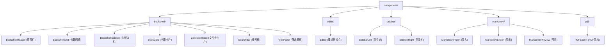

# components 模块 - React UI 组件库

[根目录](../CLAUDE.md) > **components**

> 最后更新：2026-01-10 01:20:38

---

## 模块职责

`components/` 模块包含所有 React UI 组件，按功能划分为：
- 📚 **bookshelf** - 书架首页组件（网格、卡片、侧边栏、筛选）
- ✍️ **editor** - TipTap 编辑器核心组件
- 📑 **sidebar** - 左侧章节树、右侧目录栏
- 📝 **markdown** - Markdown 导入/导出/预览
- 📄 **pdf** - PDF 导出功能

---

## 组件结构图



---

## 子模块索引

### 1. bookshelf - 书架组件

**职责：** 书架首页的 UI 组件（书籍展示、搜索、筛选）

| 组件名 | 文件 | 职责 | Props |
|--------|------|------|-------|
| `BookshelfHeader` | `bookshelf/BookshelfHeader.tsx` | 顶部栏（标题、新建按钮、视图切换） | - |
| `BookshelfGrid` | `bookshelf/BookshelfGrid.tsx` | 书籍网格/列表（筛选、排序） | `onBookClick?: (bookId: number) => void` |
| `BookshelfSidebar` | `bookshelf/BookshelfSidebar.tsx` | 左侧边栏（文件夹、标签） | - |
| `BookCard` | `bookshelf/BookCard.tsx` | 单个书籍卡片 | `book: EnhancedBook`, `onClick?: (bookId: number) => void` |
| `CollectionCard` | `bookshelf/CollectionCard.tsx` | 文件夹卡片 | `collection: Collection`, `bookCount: number` |
| `SearchBar` | `bookshelf/SearchBar.tsx` | 搜索框（带建议） | - |
| `FilterPanel` | `bookshelf/FilterPanel.tsx` | 筛选面板（排序、时间范围） | - |

**关键特性：**
- 响应式网格布局（2-6 列自适应）
- 搜索建议与历史记录
- 多维度筛选（标签、文件夹、时间范围）
- 置顶优先排序
- 卡片动画效果

**依赖：**
- `@/lib/store` - Zustand 状态
- `lucide-react` - 图标库
- `tailwind-merge` - 样式合并

---

### 2. editor - 编辑器组件

**职责：** TipTap 编辑器核心与工具栏

| 组件名 | 文件 | 职责 | Props |
|--------|------|------|-------|
| `Editor` | `editor/Editor.tsx` | TipTap 编辑器核心（工具栏 + 内容区） | - |

**关键特性：**
- 基于 TipTap 3.14 的所见即所得编辑
- 防抖自动保存（1 秒延迟）
- 实时目录提取（500ms 防抖）
- 标题 ID 生成（用于目录锚点）
- 工具栏（粗体、斜体、标题、列表、代码、引用）
- Markdown/PDF 导出

**TipTap 配置：**
```typescript
const editor = useEditor({
  extensions: [
    StarterKit.configure({
      heading: { levels: [1, 2, 3] }
    }),
    Placeholder.configure({
      placeholder: "Type '/' for commands",
      emptyEditorClass: 'is-editor-empty',
    }),
  ],
  editorProps: {
    attributes: {
      class: 'prose prose-slate prose-lg max-w-full focus:outline-hidden',
    },
  },
  onUpdate: ({ editor }) => {
    debouncedSave(editor.getHTML());      // 防抖保存
    debouncedExtractToc(editor);          // 防抖目录提取
  },
});
```

**依赖：**
- `@tiptap/react` - TipTap React 集成
- `@tiptap/starter-kit` - TipTap 基础扩展
- `@tiptap/extension-placeholder` - 占位符
- `@/lib/store` - Zustand 状态
- `@/hooks/useDebounce` - 防抖 Hook

---

### 3. sidebar - 侧边栏组件

**职责：** 左侧章节树、右侧目录栏

| 组件名 | 文件 | 职责 | Props |
|--------|------|------|-------|
| `SidebarLeft` | `sidebar/SidebarLeft.tsx` | 左侧章节树（拖拽排序、嵌套） | - |
| `SidebarRight` | `sidebar/SidebarRight.tsx` | 右侧目录栏（滚动同步、点击跳转） | - |

**SidebarLeft 关键特性：**
- 书籍切换下拉菜单
- 章节树形结构（支持多级嵌套）
- 拖拽排序（before/after/inside）
- 展开/收起子章节
- 创建/删除章节
- Markdown 批量导入

**SidebarRight 关键特性：**
- 自动提取文档标题（H1-H3）
- 滚动位置同步高亮（IntersectionObserver）
- 点击跳转到对应标题
- 响应式隐藏（移动端）

**依赖：**
- `@/lib/store` - Zustand 状态
- `@/hooks/useActiveHeading` - 滚动同步 Hook
- `lucide-react` - 图标库

---

### 4. markdown - Markdown 工具组件

**职责：** Markdown 导入、导出、预览

| 组件名 | 文件 | 职责 | Props |
|--------|------|------|-------|
| `MarkdownImport` | `markdown/MarkdownImport.tsx` | Markdown 文件导入 | `onImport: (files: File[]) => Promise<void>`, `disabled?: boolean` |
| `MarkdownExport` | `markdown/MarkdownExport.tsx` | 导出当前章节为 Markdown | `title: string`, `content: string`, `disabled?: boolean` |
| `MarkdownPreview` | `markdown/MarkdownPreview.tsx` | Markdown 实时预览 | - |

**关键特性：**
- 支持批量导入（多个 .md 文件）
- HTML → Markdown 转换（`@/lib/markdown-converter.ts`）
- Markdown 实时渲染（react-markdown + rehype-highlight）
- 导出进度提示（Loader 图标）

**依赖：**
- `react-markdown` - Markdown 渲染
- `rehype-highlight` - 代码高亮
- `remark-gfm` - GitHub Flavored Markdown
- `@/lib/markdown-converter` - 转换工具

---

### 5. pdf - PDF 导出组件

**职责：** 将编辑器内容导出为 PDF

| 组件名 | 文件 | 职责 | Props |
|--------|------|------|-------|
| `PDFExport` | `pdf/PDFExport.tsx` | 导出当前章节为 PDF | `title: string`, `disabled?: boolean` |

**关键特性：**
- 使用 html2canvas + jsPDF 生成 PDF
- 导出进度提示（Loader 图标）
- 错误处理与提示

**依赖：**
- `html2canvas` - DOM 截图
- `jspdf` - PDF 生成
- `@/lib/pdf-generator` - PDF 生成逻辑

---

## 关键依赖与配置

### 公共依赖

```json
{
  "dependencies": {
    "lucide-react": "^0.562.0",           // 图标库
    "clsx": "^2.1.0",                     // 样式拼接
    "tailwind-merge": "^3.4.0",           // Tailwind 合并
    "@tiptap/react": "^3.14.0",           // TipTap React 集成
    "@tiptap/starter-kit": "^3.14.0",     // TipTap 基础扩展
    "react-markdown": "^10.1.0",          // Markdown 渲染
    "html2canvas": "^1.4.1",              // DOM 截图
    "jspdf": "^3.0.4"                     // PDF 生成
  }
}
```

### 样式配置

- 使用 Tailwind CSS 工具类
- Notion 风格主题变量（`app/globals.css`）
- 自定义滚动条（`custom-scrollbar`）
- Prose 样式（`@utility prose`）

---

## 数据模型

### 组件 Props 类型

所有组件 Props 类型定义在 `@/lib/types.ts`：
- `EnhancedBook` - 书籍（增强版）
- `Chapter` - 章节
- `Collection` - 文件夹
- `Tag` - 标签
- `TocItem` - 目录项

---

## 测试与质量

### E2E 测试覆盖

**`e2e/bookshelf.spec.ts`**
- ✅ 书架首页布局
- ✅ 创建/编辑/删除书籍
- ✅ 搜索与筛选
- ✅ 视图切换

**`e2e/chapter-management.spec.ts`**
- ✅ 章节树渲染
- ✅ 创建/删除章节
- ✅ 拖拽排序
- ✅ 章节嵌套

**`e2e/toc-navigation.spec.ts`**
- ✅ 目录提取
- ✅ 滚动同步
- ✅ 点击跳转

**`e2e/editor.spec.ts`**
- ✅ 编辑器输入
- ✅ 格式化工具栏
- ✅ 自动保存
- ✅ Markdown/PDF 导出

---

## 常见问题 (FAQ)

### Q1: 为什么使用 `lucide-react` 而不是其他图标库？

**A:** Lucide React 完全 Tree-shakable、0 依赖、TypeScript 原生支持，与项目技术栈匹配。

### Q2: 如何自定义 TipTap 工具栏？

**A:** 在 `components/editor/Editor.tsx` 中修改 `ToolbarButton` 组件：
```typescript
<ToolbarButton
  onClick={() => editor.chain().focus().toggleBold().run()}
  isActive={editor.isActive('bold')}
  icon={Bold}
  title="Bold"
/>
```

### Q3: 拖拽排序如何实现？

**A:** 使用 HTML5 Drag and Drop API：
```typescript
onDragStart={(e) => handleDragStart(e, node.id!)}
onDragOver={(e) => handleDragOver(e, node.id!)}
onDrop={(e) => handleDrop(e, node.id!)}
```

位置计算基于鼠标在目标元素的位置（上 25%、下 25%、中间 50%）。

### Q4: 如何添加新的书架组件？

**A:** 在 `components/bookshelf/` 下创建新文件，导出函数组件：
```typescript
// components/bookshelf/NewFeature.tsx
"use client";

import { useStore } from '@/lib/store';

export const NewFeature = () => {
  const { books } = useStore();
  return <div>{/* 组件内容 */}</div>;
};
```

---

## 相关文件清单

### 核心组件

- `components/bookshelf/BookshelfGrid.tsx` - 书籍网格（171 行）
- `components/bookshelf/BookCard.tsx` - 书籍卡片
- `components/bookshelf/BookshelfHeader.tsx` - 顶部栏
- `components/bookshelf/BookshelfSidebar.tsx` - 侧边栏
- `components/bookshelf/CollectionCard.tsx` - 文件夹卡片
- `components/bookshelf/SearchBar.tsx` - 搜索框
- `components/bookshelf/FilterPanel.tsx` - 筛选面板

- `components/editor/Editor.tsx` - 编辑器核心（224 行）

- `components/sidebar/SidebarLeft.tsx` - 左侧章节树（378 行）
- `components/sidebar/SidebarRight.tsx` - 右侧目录栏（58 行）

- `components/markdown/MarkdownImport.tsx` - Markdown 导入
- `components/markdown/MarkdownExport.tsx` - Markdown 导出（67 行）
- `components/markdown/MarkdownPreview.tsx` - Markdown 预览

- `components/pdf/PDFExport.tsx` - PDF 导出（49 行）

### 依赖模块

- `@/lib/store.ts` - Zustand 状态管理
- `@/lib/types.ts` - 类型定义
- `@/lib/markdown-converter.ts` - Markdown 转换
- `@/lib/pdf-generator.ts` - PDF 生成
- `@/hooks/useDebounce.ts` - 防抖 Hook
- `@/hooks/useActiveHeading.ts` - 滚动同步 Hook

---

## 下一步优化建议

1. **组件拆分**
   - `Editor.tsx` 拆分为 `Editor.tsx` + `Toolbar.tsx` + `EditorContent.tsx`
   - `SidebarLeft.tsx` 拆分为 `ChapterTree.tsx` + `BookSwitcher.tsx`

2. **性能优化**
   - 使用 `React.memo` 优化 `BookCard` 渲染
   - 虚拟滚动（大书籍列表）
   - 图片懒加载

3. **可访问性**
   - 添加 ARIA 标签
   - 键盘导航支持
   - 屏幕阅读器测试

4. **测试覆盖**
   - 组件单元测试（Vitest + Testing Library）
   - 视觉回归测试（Chromatic）

---

**文档生成时间：** 2026-01-10 01:20:38
**模块覆盖状态：** ✅ 完整
