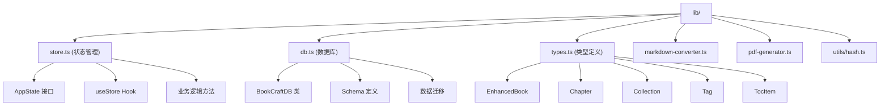

# lib 模块 - 核心逻辑层

[根目录](../CLAUDE.md) > **lib**

> 最后更新：2026-01-10 01:20:38

---

## 模块职责

`lib/` 模块是项目的核心逻辑层，包含：
- 🗄️ **数据库层** - Dexie.js IndexedDB 封装（`db.ts`）
- 📦 **状态管理** - Zustand 全局状态（`store.ts`）
- 🔢 **类型定义** - TypeScript 类型系统（`types.ts`）
- 🔄 **数据转换** - Markdown/PDF 工具（`markdown-converter.ts`, `pdf-generator.ts`）
- 🔐 **工具函数** - Hash 生成（`utils/hash.ts`）

---

## 模块结构图



---

## 文件索引

### 核心文件

| 文件名 | 行数 | 职责 | 导出 |
|--------|------|------|------|
| `store.ts` | 822 | Zustand 状态管理与业务逻辑 | `useStore`, `useClientStore` |
| `db.ts` | 63 | Dexie.js 数据库初始化与 Schema | `BookCraftDB`, `getDb` |
| `types.ts` | 161 | TypeScript 类型定义 | `AppState`, `EnhancedBook`, `Chapter`, etc. |
| `markdown-converter.ts` | 184 | Markdown ↔ HTML 转换 | `htmlToMarkdown`, `markdownToHtml`, `downloadMarkdown` |
| `pdf-generator.ts` | ~100 | PDF 生成逻辑 | `generatePDFFromDOM` |
| `utils/hash.ts` | ~30 | 标题 ID 生成 | `generateHeadingId` |

---

## 1. 状态管理 (store.ts)

### 职责

- 全局状态管理（书籍、章节、文件夹、标签）
- 业务逻辑封装（CRUD 操作）
- 客户端数据持久化（通过 Dexie.js）

### 核心 Hook

**`useStore` - 客户端状态**
```typescript
export const useStore = create<AppState>((set, get) => ({
  // 状态
  books: [],
  chapters: [],
  currentBook: null,
  currentChapter: null,
  isLoading: true,
  isSaving: false,
  toc: [],
  collections: [],
  tags: [],
  filterConfig: defaultFilterConfig,

  // 方法
  loadData: async () => { /* 加载所有数据 */ },
  createBook: async (title, description) => { /* 创建书籍 */ },
  deleteBook: async (id) => { /* 删除书籍 */ },
  selectBook: async (book) => { /* 选择书籍 */ },
  // ... 更多方法
}));
```

**`useClientStore` - SSR 兼容包装器**
```typescript
export const useClientStore = () => {
  if (typeof window === 'undefined') {
    // 返回空实现（服务端）
    return { books: [], chapters: [], /* ... */ };
  }
  return useStore();
};
```

### 状态结构

```typescript
interface AppState {
  // 原有状态
  books: EnhancedBook[];
  chapters: Chapter[];
  currentBook: EnhancedBook | null;
  currentChapter: Chapter | null;
  isLoading: boolean;
  isSaving: boolean;
  toc: TocItem[];

  // 书架新增状态
  collections: Collection[];
  tags: Tag[];
  currentCollection: Collection | null;
  searchQuery: string;
  searchHistory: SearchHistory[];
  searchSuggestions: string[];
  filterConfig: FilterConfig;
  viewMode: ViewMode;

  // 方法（详见下文）
}
```

### 核心方法分类

#### 书籍操作

| 方法 | 参数 | 返回值 | 说明 |
|------|------|--------|------|
| `loadData` | - | `Promise<void>` | 加载所有数据（书籍、文件夹、标签） |
| `createBook` | `title, description` | `Promise<void>` | 创建新书籍（自动创建第一章） |
| `deleteBook` | `id` | `Promise<void>` | 删除书籍（级联删除章节） |
| `selectBook` | `book` | `Promise<void>` | 选择书籍（加载章节列表） |
| `updateBook` | `id, updates` | `Promise<void>` | 更新书籍信息 |
| `pinBook` | `id, isPinned` | `Promise<void>` | 置顶/取消置顶 |

#### 章节操作

| 方法 | 参数 | 返回值 | 说明 |
|------|------|--------|------|
| `createChapter` | `bookId, title` | `Promise<void>` | 创建新章节 |
| `deleteChapter` | `id` | `Promise<void>` | 删除章节 |
| `selectChapter` | `chapter` | `void` | 选择章节（切换编辑器内容） |
| `updateChapterContent` | `id, content` | `Promise<void>` | 更新章节内容（防抖保存） |
| `updateChapterTitle` | `id, title` | `Promise<void>` | 更新章节标题 |
| `reorderChapter` | `chapterId, targetId, position` | `Promise<void>` | 拖拽排序（before/after/inside） |

#### 文件夹操作

| 方法 | 参数 | 返回值 | 说明 |
|------|------|--------|------|
| `loadCollections` | - | `Promise<void>` | 加载所有文件夹 |
| `createCollection` | `name, color` | `Promise<number>` | 创建文件夹（返回 ID） |
| `updateCollection` | `id, updates` | `Promise<void>` | 更新文件夹 |
| `deleteCollection` | `id` | `Promise<void>` | 删除文件夹（书籍移到根目录） |
| `selectCollection` | `collection` | `void` | 选择文件夹（筛选） |

#### 标签操作

| 方法 | 参数 | 返回值 | 说明 |
|------|------|--------|------|
| `loadTags` | - | `Promise<void>` | 加载所有标签 |
| `createTag` | `name, color` | `Promise<number>` | 创建标签（返回 ID） |
| `updateTag` | `id, updates` | `Promise<void>` | 更新标签 |
| `deleteTag` | `id` | `Promise<void>` | 删除标签（从所有书籍移除） |
| `addTagToBook` | `bookId, tagName` | `Promise<void>` | 给书籍添加标签 |
| `removeTagFromBook` | `bookId, tagName` | `Promise<void>` | 从书籍移除标签 |

#### 搜索与筛选

| 方法 | 参数 | 返回值 | 说明 |
|------|------|--------|------|
| `setSearchQuery` | `query` | `void` | 设置搜索关键词 |
| `addToSearchHistory` | `query` | `Promise<void>` | 添加搜索历史 |
| `clearSearchHistory` | - | `Promise<void>` | 清除搜索历史 |
| `generateSearchSuggestions` | `query` | `Promise<void>` | 生成搜索建议 |
| `updateFilterConfig` | `config` | `void` | 更新筛选配置 |
| `setViewMode` | `mode` | `void` | 设置视图模式（grid/list） |

#### 导入导出

| 方法 | 参数 | 返回值 | 说明 |
|------|------|--------|------|
| `importMarkdown` | `bookId, content` | `Promise<void>` | 导入 Markdown（按一级标题分章节） |
| `importMultipleFiles` | `files` | `Promise<void>` | 批量导入（每个文件创建新书籍） |
| `setToc` | `toc` | `void` | 更新目录（由编辑器调用） |

### 关键特性

**1. 乐观更新（Optimistic Update）**
```typescript
updateChapterContent: async (id, content) => {
  // 先更新 UI
  set(state => ({
    chapters: state.chapters.map(c =>
      c.id === id ? { ...c, content, updatedAt: Date.now() } : c
    )
  }));

  // 再持久化
  await database.chapters.update(id, { content, updatedAt: Date.now() });
}
```

**2. 客户端检查**
```typescript
if (typeof window === 'undefined') return; // 避免服务端执行
```

**3. 批量操作**
```typescript
await (database as any).transaction('rw', database.books, database.chapters, async () => {
  await database.chapters.where({ bookId: id }).delete();
  await database.books.delete(id);
});
```

---

## 2. 数据库层 (db.ts)

### 职责

- Dexie.js 数据库初始化
- Schema 定义与索引
- 数据迁移（版本升级）

### 数据库类

```typescript
export class BookCraftDB extends Dexie {
  books!: Table<EnhancedBook, number>;
  chapters!: Table<Chapter, number>;
  collections!: Table<Collection, number>;
  tags!: Table<Tag, number>;
  searchHistory!: Table<SearchHistory, number>;

  constructor() {
    super('BookCraftDB');

    // Version 1: 原始 Schema
    this.version(1).stores({
      books: '++id, title, updatedAt',
      chapters: '++id, bookId, title, order, updatedAt'
    });

    // Version 2: 添加书架功能
    this.version(2).stores({
      books: '++id, title, updatedAt, collectionId, [collectionId+updatedAt], tags, lastReadAt, isPinned',
      chapters: '++id, bookId, title, order, updatedAt',
      collections: '++id, name, order, updatedAt',
      tags: '++id, name, usageCount',
      searchHistory: '++id, query, timestamp',
    }).upgrade((tx) => {
      // 数据迁移：为现有书籍添加默认字段
      tx.table('books').toCollection().modify((book) => {
        book.collectionId = null;
        book.tags = [];
        book.coverColor = randomColor();
        book.wordCount = 0;
        book.lastReadAt = null;
        book.isPinned = false;
      });
    });
  }
}
```

### Schema 索引说明

| 表名 | 索引 | 用途 |
|------|------|------|
| `books` | `++id` | 自增主键 |
| `books` | `title` | 按标题搜索 |
| `books` | `updatedAt` | 按更新时间排序 |
| `books` | `collectionId` | 按文件夹筛选 |
| `books` | `[collectionId+updatedAt]` | 复合索引（文件夹内排序） |
| `books` | `tags` | 多值索引（标签搜索） |
| `books` | `lastReadAt` | 按阅读时间排序 |
| `books` | `isPinned` | 置顶筛选 |
| `chapters` | `bookId` | 按书籍查询章节 |
| `chapters` | `order` | 按顺序排序 |
| `collections` | `order` | 按顺序排序 |
| `tags` | `name` | 按名称搜索 |
| `tags` | `usageCount` | 按使用次数排序 |
| `searchHistory` | `timestamp` | 按时间排序 |

### 延迟初始化

```typescript
let dbInstance: BookCraftDB | null = null;

export const getDb = () => {
  if (typeof window === 'undefined') {
    throw new Error('Dexie can only be used in the browser');
  }
  if (!dbInstance) {
    dbInstance = new BookCraftDB();
  }
  return dbInstance;
};
```

---

## 3. 类型定义 (types.ts)

### 核心类型

**书籍（增强版）**
```typescript
export interface EnhancedBook {
  id?: number;
  title: string;
  description: string;
  createdAt: number;
  updatedAt: number;
  collectionId?: number | null;      // 所属文件夹 ID
  tags: string[];                     // 标签数组
  coverColor: string;                 // 封面颜色
  wordCount: number;                  // 字数统计
  lastReadAt: number | null;          // 最后阅读时间
  isPinned: boolean;                  // 是否置顶
}
```

**章节**
```typescript
export interface Chapter {
  id?: number;
  bookId: number;
  title: string;
  content: string;                    // HTML from TipTap
  order: number;
  parentId?: number | null;           // 支持嵌套
  updatedAt: number;
}
```

**文件夹**
```typescript
export interface Collection {
  id?: number;
  name: string;
  color: string;
  icon?: string;
  createdAt: number;
  updatedAt: number;
  order: number;
}
```

**标签**
```typescript
export interface Tag {
  id?: number;
  name: string;
  color: string;
  usageCount: number;
  createdAt: number;
}
```

**目录项**
```typescript
export interface TocItem {
  id: string;
  level: number;                      // 1-6
  text: string;
  elementId?: string;
}
```

**筛选配置**
```typescript
export interface FilterConfig {
  sortBy: 'updatedAt' | 'createdAt' | 'title' | 'wordCount' | 'lastReadAt';
  sortOrder: 'asc' | 'desc';
  filterByTags: string[];
  filterByCollection: number | null;
  timeRange?: 'all' | 'today' | 'week' | 'month' | 'year';
}
```

---

## 4. 工具函数

### Markdown 转换器 (markdown-converter.ts)

**职责：** TipTap HTML ↔ Markdown 转换

| 函数 | 参数 | 返回值 | 说明 |
|------|------|--------|------|
| `htmlToMarkdown` | `html: string` | `string` | HTML → Markdown |
| `markdownToHtml` | `markdown: string` | `string` | Markdown → HTML（简化版） |
| `downloadMarkdown` | `content: string, filename: string` | `void` | 下载 .md 文件 |
| `readMarkdownFile` | `file: File` | `Promise<string>` | 读取上传的 Markdown 文件 |

**支持格式：**
- 标题（H1-H6）
- 粗体、斜体、删除线
- 有序/无序列表
- 代码块（带语言）
- 链接、图片
- 引用块
- 水平分隔线

### PDF 生成器 (pdf-generator.ts)

**职责：** 使用 html2canvas + jsPDF 生成 PDF

| 函数 | 参数 | 返回值 | 说明 |
|------|------|--------|------|
| `generatePDFFromDOM` | `title: string, element: HTMLElement` | `Promise<void>` | 将 DOM 元素转换为 PDF |

**流程：**
1. 使用 html2canvas 截取 DOM
2. 转换为图片（PNG）
3. 使用 jsPDF 生成 PDF 文档
4. 自动下载

### Hash 生成器 (utils/hash.ts)

**职责：** 为标题生成唯一 ID（用于目录锚点）

| 函数 | 参数 | 返回值 | 说明 |
|------|------|--------|------|
| `generateHeadingId` | `text: string, level: number, index: number` | `string` | 生成唯一 ID（如 `heading-1-h2-0`） |

---

## 关键依赖与配置

### 依赖项

```json
{
  "dependencies": {
    "zustand": "^5.0.9",        // 状态管理
    "dexie": "^4.2.1",          // IndexedDB 封装
    "html2canvas": "^1.4.1",    // DOM 截图
    "jspdf": "^3.0.4"           // PDF 生成
  }
}
```

### 环境检查

所有数据库和状态操作必须检查客户端环境：
```typescript
if (typeof window === 'undefined') return;
```

---

## 测试与质量

### 单元测试（待补充）

- ✅ 数据库 CRUD 操作测试
- ✅ Markdown 转换测试
- ✅ 状态管理逻辑测试
- ⏳ PDF 生成测试（需浏览器环境）

### E2E 测试覆盖

所有 `lib/` 功能通过 E2E 测试间接验证：
- `e2e/bookshelf.spec.ts` - 书架 CRUD
- `e2e/chapter-management.spec.ts` - 章节 CRUD
- `e2e/import-export.spec.ts` - 导入导出

---

## 常见问题 (FAQ)

### Q1: 为什么使用 Dexie.js 而不是 LocalStorage？

**A:** IndexedDB 支持更大存储空间（~100MB vs 5MB）、异步操作、索引查询，适合大量书籍和章节数据。

### Q2: 如何添加新的数据库表？

**A:** 在 `lib/db.ts` 中创建新版本：
```typescript
this.version(3).stores({
  // 新表
  notes: '++id, bookId, createdAt',
  // 更新现有表索引
  books: '++id, title, updatedAt, collectionId'
}).upgrade((tx) => {
  // 数据迁移逻辑
});
```

### Q3: 为什么使用 Zustand 而不是 Redux？

**A:** Zustand 更轻量（3.1KB vs 15KB）、无样板代码、支持 React 并发模式、TypeScript 友好。

### Q4: 如何处理状态更新冲突？

**A:** 使用乐观更新 + 事务回滚：
```typescript
// 1. 先更新 UI
set(state => ({ ... }));

// 2. 持久化到数据库
try {
  await database.update(id, data);
} catch (error) {
  // 3. 失败时回滚
  set(state => ({ ...originalState }));
}
```

### Q5: 如何备份和恢复数据？

**A:** 使用 Dexie.js 的 `export()` 和 `import()`：
```typescript
// 备份
const blob = await database.export();
downloadJSON(blob, 'backup.json');

// 恢复
await database.import(jsonFile);
```

---

## 相关文件清单

### 核心文件

- `lib/store.ts` - Zustand 状态管理（822 行）
- `lib/db.ts` - Dexie 数据库（63 行）
- `lib/types.ts` - 类型定义（161 行）
- `lib/markdown-converter.ts` - Markdown 转换（184 行）
- `lib/pdf-generator.ts` - PDF 生成（~100 行）
- `lib/utils/hash.ts` - Hash 生成（~30 行）

### 依赖模块

- `@/components/*` - UI 组件（调用 store 方法）
- `@/app/*` - Next.js 页面（调用 store 方法）
- `@/e2e/*` - E2E 测试（验证功能）

---

## 下一步优化建议

1. **性能优化**
   - 使用 `immer` 中间件简化不可变更新
   - 虚拟滚动（大章节列表）
   - IndexedDB 索引优化

2. **数据安全**
   - 自动备份（每日）
   - 数据导出（JSON 格式）
   - 数据加密（敏感内容）

3. **测试覆盖**
   - 单元测试（Vitest）
   - 集成测试（Dexie + Zustand）
   - 快照测试（状态变更）

4. **错误处理**
   - 全局错误边界
   - 数据库降级方案（LocalStorage 备份）
   - 用户友好的错误提示

---

**文档生成时间：** 2026-01-10 01:20:38
**模块覆盖状态：** ✅ 完整
